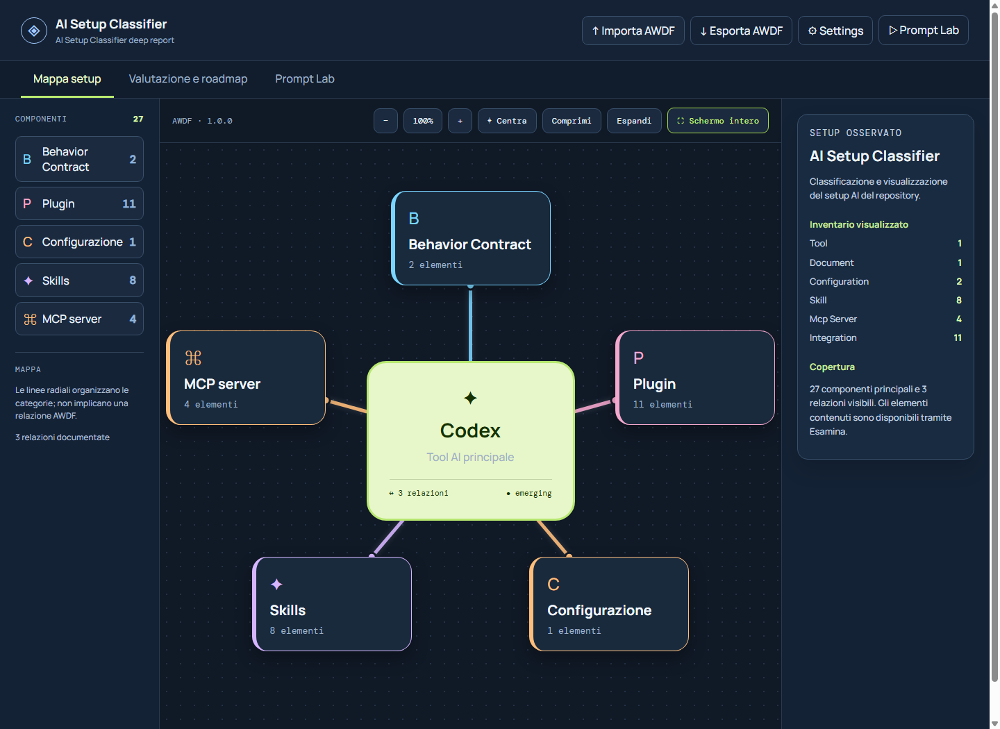
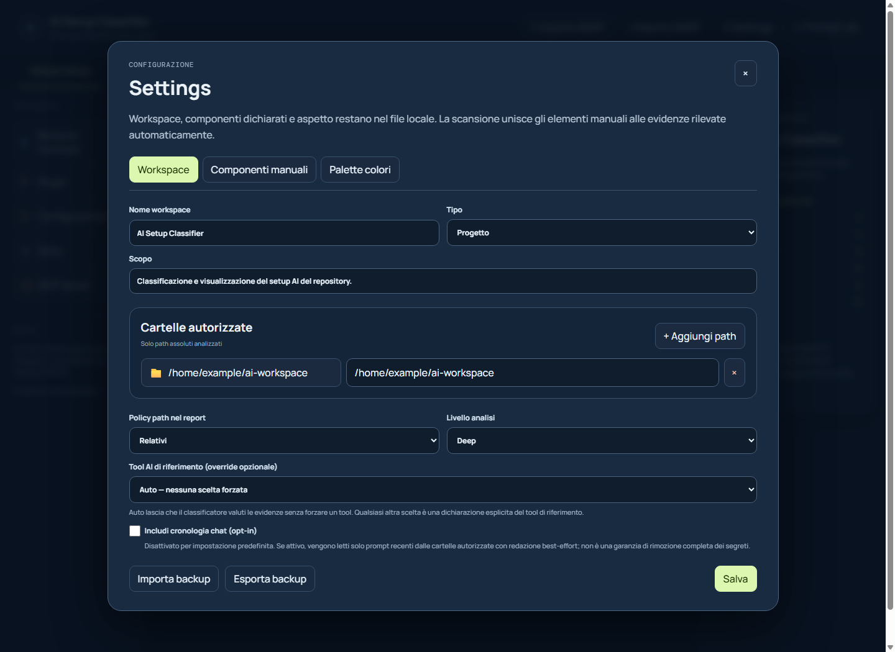
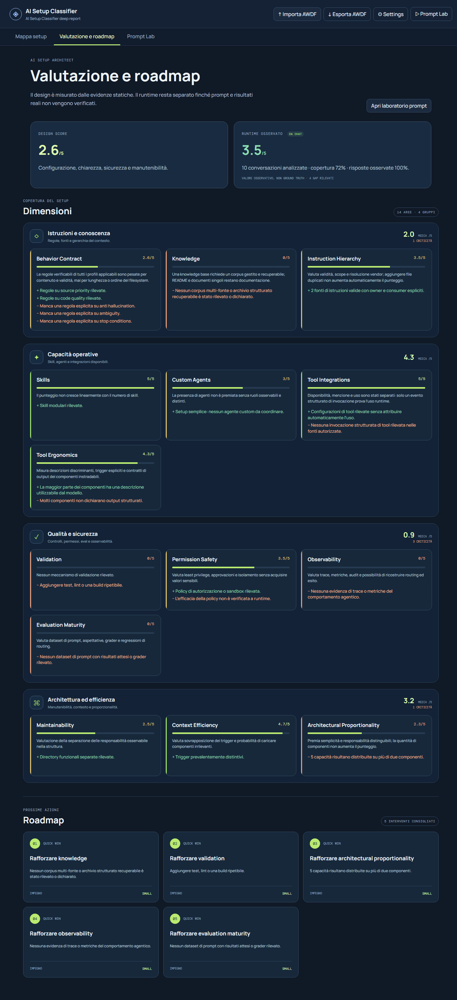
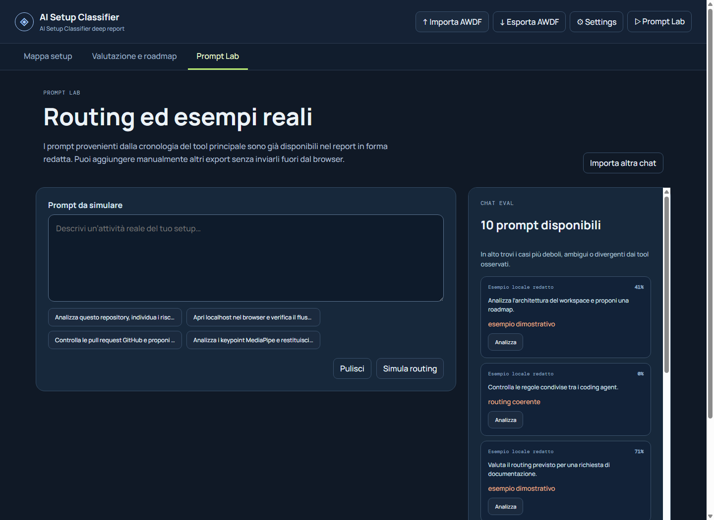

# AI Setup Classifier · AWDF

AI Setup Classifier performs a read-only analysis of one or more AI-assisted development workspaces, produces a standard **AWDF 1.0.0** report, and makes it explorable through a local interface. The report describes components, relationships, workflows, evidence, maturity, findings, and recommended actions.



```text
Authorized workspaces → Scanner → ai-setup.json → Validator → Local viewer
                                          ↓
                              Assessment · Roadmap · Prompt Lab
```

## Quick start

Node.js and npm are required. For a fresh installation:

```bash
git clone https://github.com/Luca-it15/set-up_classification.git
cd set-up_classification
npm install && npm start
```

Open [http://127.0.0.1:3000](http://127.0.0.1:3000). `npm start` is the only startup command: a single Node process serves both the React interface and the local settings/report APIs. On subsequent runs, use:

```bash
npm start
```

To change the address or port:

```bash
AWDF_HOST=0.0.0.0 AWDF_PORT=3100 npm start
```

In PowerShell:

```powershell
$env:AWDF_HOST='0.0.0.0'; $env:AWDF_PORT='3100'; npm start
```

## Initial configuration and scanning

1. Open **Settings → Workspace** and add at least one folder using the system folder picker or an absolute path.
2. Set the workspace name, purpose, type, path policy, and analysis depth.
3. Keep **Chat history** disabled unless you intentionally opt in. Redaction is best-effort and cannot guarantee that every secret is removed.
4. Select **Save**. Preferences are stored locally in `ai-setup-settings.json`.
5. Run the scan in a second terminal, then refresh the page:

```bash
npm run scan:setup
```

The scanner only accepts folders explicitly authorized in the settings. It does not execute discovered code, skips dependencies/build artifacts/caches, and does not read sensitive files. It generates `ai-setup.json` and validates the new report before replacing the previous one.



## Interface guide

### Setup map

The initial view places the reference AI tool at the center and groups workspace components by category. You can:

- expand or collapse individual categories or the entire map;
- drag the canvas, adjust zoom, recenter it, and enter full-screen mode;
- select a node to inspect its description, capabilities, triggers, and relationships;
- use **Examine component** to open the complete hierarchy of contained elements;
- distinguish layout spokes from relationships actually documented in AWDF.

### Assessment and roadmap

This page keeps observed design quality separate from unverified runtime behavior. Dimensions are grouped by coverage, safety, ergonomics, and operational maturity. Each card shows its score, rationale, strengths, and weaknesses. The roadmap orders proposed improvements by priority and estimated effort.



### Prompt Lab

Prompt Lab statically simulates how a request would be routed without executing agents or tools. Enter a prompt, select an example, or import a chat. The result shows the predicted sequence, confidence, candidate components, routing gaps, and warnings about primary-tool resolution. Results can be exported to `simulation-result.json`.



### Settings, manual components, and palettes

Settings let you:

- authorize multiple folders and define exclusions;
- select `inventory`, `standard`, or `deep` analysis;
- keep reference-tool detection automatic or explicitly declare Codex, Claude Code, or GitHub Copilot;
- add components and nested elements that cannot be detected automatically;
- customize dark/light palettes, the canvas, central node, and category colors;
- import and export `ai-setup-settings.json` backups.

The top bar imports and exports AWDF documents. Imported files are processed in the browser; **Export AWDF** downloads the report currently displayed.

## What it detects and how it is assessed

The classifier builds:

- an inventory of behavior contracts, documents, skills, agents, plugins, MCP servers, tools, models, workflows, repositories, services, and configurations;
- relationships and hierarchies with verifiable cross-references;
- evidence using relative, anonymized, or absolute paths;
- assessments of behavior contracts, knowledge, skills, custom agents, integrations, validation, maintainability, tool ergonomics, permission safety, context efficiency, instruction hierarchy, architectural proportionality, observability, and evaluations;
- findings and recommendations linked to their supporting evidence.

Tool presence does not prove tool usage: `configured` means a configuration was observed, `mentioned` means the name only appeared in text, and `used` requires a structured invocation event. Codex, Claude Code, and GitHub Copilot are resolved through deterministic rules and may coexist without arbitrarily forcing a primary tool.

## AWDF Evaluator skill

The skill in `skills/setup-evaluator/` uses the portable `SKILL.md` format and contains no vendor-specific frontmatter. The Node installer copies it to the correct location for Codex, Claude Code, and GitHub Copilot.

Install it for all three clients at user scope:

```bash
npm run skill:install -- all
```

With `all`, Codex and Copilot share the standard copy in `~/.agents/skills`, while Claude uses `~/.claude/skills`. This avoids duplicate skills in clients that recognize multiple directories.

Install it for one client only:

```bash
npm run skill:install -- codex
npm run skill:install -- claude
npm run skill:install -- copilot
```

Install it only for this repository:

```bash
npm run skill:install -- all --scope=project
```

| Client | User scope | Repository scope | Invocation |
| --- | --- | --- | --- |
| Codex | `~/.agents/skills/awdf-evaluator` | `.agents/skills/awdf-evaluator` | `$awdf-evaluator` |
| Claude Code | `~/.claude/skills/awdf-evaluator` | `.claude/skills/awdf-evaluator` | `/awdf-evaluator` |
| GitHub Copilot | `~/.copilot/skills/awdf-evaluator` | `.github/skills/awdf-evaluator` | `/awdf-evaluator` or automatic selection |

The skill depends on this repository's schemas and scripts, so start the client from the clone root. After installation, ask for example:

```text
Use awdf-evaluator to analyze the authorized folders and generate a new validated ai-setup.json report.
```

## Available commands

| Command | Purpose |
| --- | --- |
| `npm start` | Start the local API and interface on `127.0.0.1:3000` |
| `npm run scan:setup` | Scan authorized folders and generate `ai-setup.json` |
| `npm run validate:awdf` | Validate schemas, versions, references, and evidence rules |
| `npm run validate:settings` | Validate `ai-setup-settings.json` |
| `npm run validate:simulation` | Validate `simulation-result.json` against the AWDF report |
| `npm run build` | Generate the Vite build in `dist/` |
| `npm test` | Run AWDF, tool-rule, scanner, simulator, and build tests |
| `npm run skill:install -- <target>` | Install the skill for `all`, `codex`, `claude`, or `copilot` |

## Generated files and privacy

`ai-setup.json`, `ai-setup-settings.json`, `simulation-result.json`, and local reports may contain paths or scan results and must never contain credentials, tokens, cookies, passwords, or private keys. The main local artifacts are ignored by Git. Select the `relative` or `anonymized` path policy before sharing a report.

## Repository structure

```text
schemas/         Draft 2020-12 JSON Schemas for AWDF, settings, and simulations
scripts/         Scanner, validators, tests, and the cross-platform skill installer
skills/          AWDF Evaluator skill and tool glossary
specification/   AWDF format, classification rules, vendor rules, and versioning
src/             React viewer, settings editor, and routing simulator
examples/        Sample reports and configurations
tests/           Valid/invalid fixtures and conformance tests
server.mjs       Local HTTP server, API, and Vite middleware
```

Local endpoints used by the interface:

- `GET /api/settings` and `PUT /api/settings` read and save validated settings;
- `GET /api/report` loads the local report or the tracked example;
- `POST /api/select-folder` opens the native folder picker.

For normative details, see the [AWDF specification](specification/AWDF-SPECIFICATION.md), [classification standard](specification/CLASSIFICATION-STANDARD.md), [Codex/Claude/Copilot rules](specification/AI-TOOL-RULES.md), and [versioning policy](specification/VERSIONING.md).

## License

[MIT](LICENSE)
